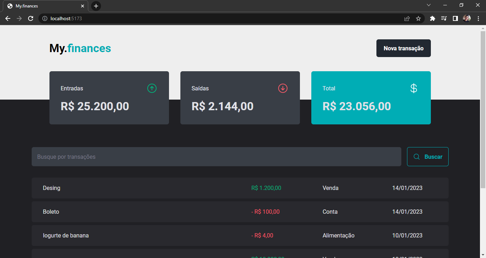

<h1 align="center">💲 My.finances 💲</h1>
 
 
 
 ## ✔️ Techniques and technologies used

- ``HTML5`` ``CSS3`` ``JavaScript`` ``TypeScript`` ``ReactJS`` ``Google Fonts`` ``CSS Modules`` ``Vite`` ``Vite`` ``JSON Server`` ``Zod`` ``Axios`` ``ESLint`` ``Hooks`` ``ReactJS`` ``HTTP`` ``API``

 

 

## 📁 Project access
You can access the project files by clicking [here](https://github.com/Coastony/my_finances)

## 💻 How i use

<ol>
 <li>Dowload the files</li>
 <li>In first terminal execute: <strong>npm run dev</strong></li>
 <li>In second terminal execute: <strong>npx json-server server.json -w -d 500</strong></li>
</ol>
